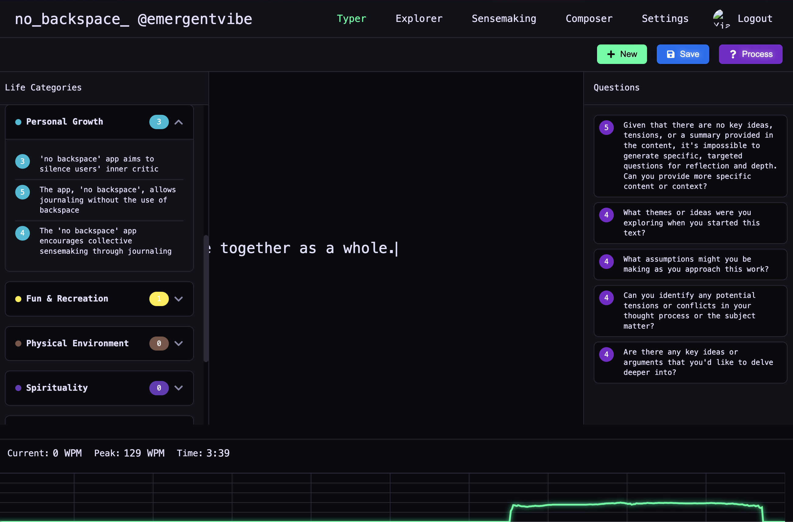

# no_backspace_app Frontend

This is the frontend for the "no_backspace" application, a unique note-taking tool designed to encourage a stream of consciousness by separating the act of writing from the act of editing.



## Core Concept

The application is built on a simple but powerful idea: **capture now, make sense later.**

1.  **Capture**: The writing environment (`Typer`) is a distraction-free space where you are encouraged to write continuously. This helps silence your "inner critic" and get your raw thoughts onto the page.
2.  **Sensemaking**: After your writing session, you can use a suite of AI-powered tools to analyze your text. The app can generate summaries, extract key ideas and tensions, and even formulate thought-provoking questions to help you reflect on your work.

## Key Features

-   **Distraction-Free Writing Interface**: A minimalist UI focused purely on the text.
-   **AI-Powered Analysis**: Automatically generate titles, summaries, key ideas, tensions, and questions from your text.
-   **Life Categories**: Ideas are automatically categorized into areas like 'Personal Growth', 'Career', and 'Health'.
-   **Session Explorer**: A powerful interface to search and review all your past notes.
-   **Semantic Search**: Search for notes based on concepts and ideas, not just keywords.
-   **Cross-Session Sensemaking**: Analyze multiple notes together to find connections and themes across your writing.
-   **Real-time Analytics**: A live graph tracks your words-per-minute (WPM) to help you stay in a state of flow.
-   **Secure Authentication**: Uses Google Sign-In for easy and secure access.

## Technology Stack

-   **Framework**: React (v18)
-   **Routing**: `react-router-dom` (v6)
-   **Authentication**: Google Identity Services (GSI)
-   **Styling**: Plain CSS with CSS Variables for theming.
-   **Icons**: `react-icons`

## Getting Started

To run the frontend locally, please ensure the backend server is running first.

1.  **Navigate to the Directory**:
    ```bash
    cd no-backspace-app
    ```

2.  **Create Environment File**:
    Create a `.env` file in the root of this directory. You will need to get a Client ID from the [Google Cloud Console](https://console.cloud.google.com/).
    ```env
    REACT_APP_GOOGLE_CLIENT_ID=your_google_client_id.apps.googleusercontent.com
    ```

3.  **Install Dependencies**:
    ```bash
    npm install
    ```

4.  **Run the Development Server**:
    ```bash
    npm start
    ```

5.  The application will open in your browser, typically at `http://localhost:3000`.